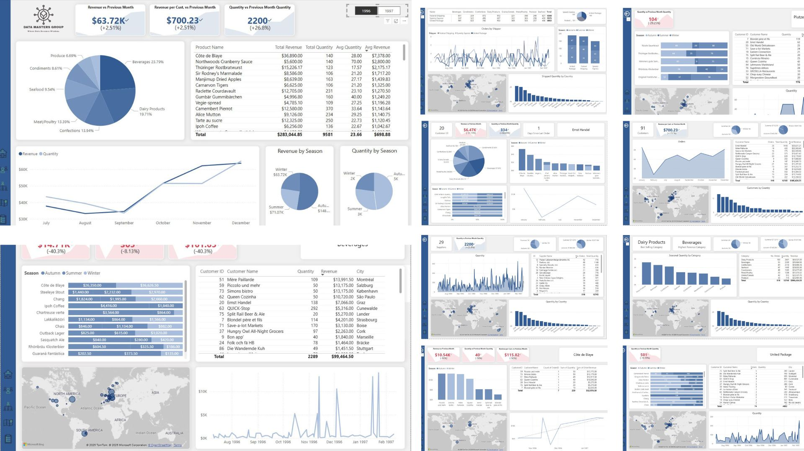
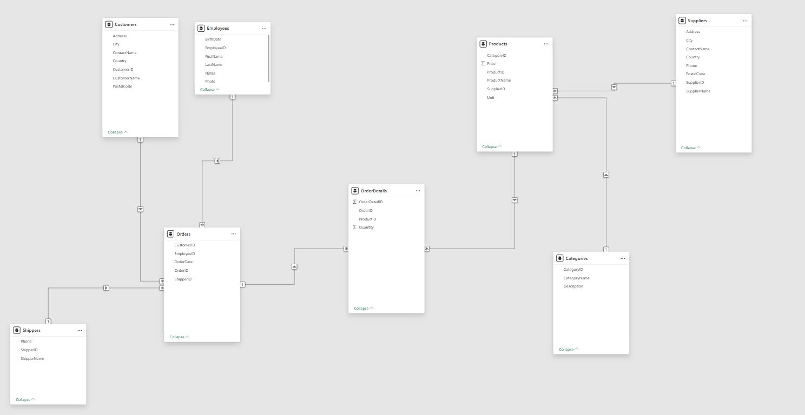
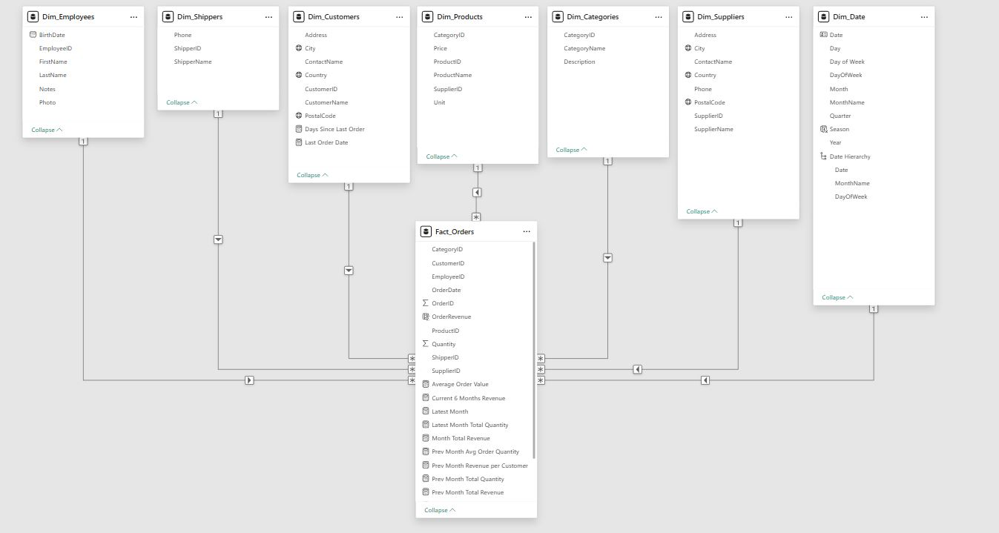
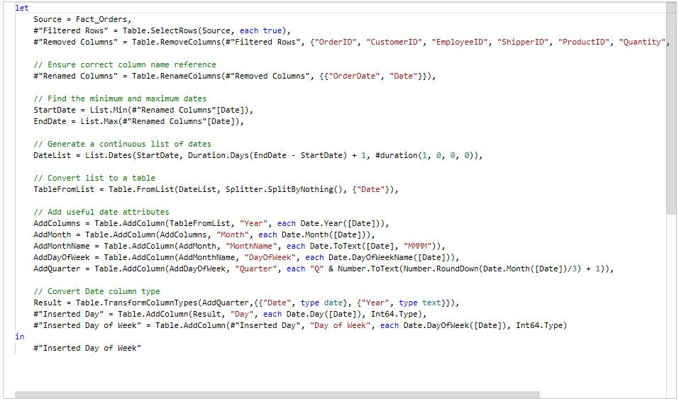

# 📊 Multi-Page Dashboard — Group Project

## Overview
This project was initiated outside of allocated bootcamp hours as a collaborative effort among participants of a **Just IT Data Technician Bootcamp**. The goal was to bring together individuals who had never met before to work as a team on a **data analytics and dashboarding challenge**.

Over the course of **four weeks**, our team of five members—each bringing expertise in **Project Management, Data Analytics, Web Analytics, and Sports Analytics**—worked beyond the bootcamp structure to develop a fully functional multi-page dashboard.

We conducted regular **Zoom meetings** after bootcamp sessions and established **Slack channels** to streamline communication and workflow.



---

## 🚀 Project Collaborators
A huge thank you to our dedicated team members for their expertise and commitment:

- **Aleksandr Ivanov (Me):** [LinkedIn](https://www.linkedin.com/in/data-aleks/)
- **Jack Poole:** [LinkedIn](https://www.linkedin.com/in/jack-poole-10650b365/)
- **Arrey Panquang:** [LinkedIn](https://www.linkedin.com/in/arrey-panquang-0b56539/)
- **Daniel Yuen:** [LinkedIn](https://www.linkedin.com/in/daniel-yuen-a721895/)
- **Dragan Ceran:** [LinkedIn](https://www.linkedin.com/in/draganceran/)

---

## 📅 Meeting Timeline & Progress

### 🔹 Week 1: Team Formation & Initial Planning
- **01.05 — First Meeting:** Team introductions  
- **02.05 — Second Meeting:**  
  - Set up Slack and Zoom communication channels  
  - Chose the dataset and initiated technical work  
  - Data cleaning tasks: removing trailing spaces, ensuring correct data types  

### 🔹 Week 2: Project Framework & Dashboard Structure
- **07.05 — Third Meeting:**  
  - Proposed a **star schema model** to replace the previous **snowflake model**  
  - Merged `Orders` and `OrderDetails` tables into a single **Fact Table** in Power BI  
  - Defined key sections: **Products, Customers, Suppliers, Shippers, Categories**  
  - Established **drill-down overview pages**  

  
  

- **08.05 — Fourth Meeting:**  
  - Refined main pages and subcategories  
  - Shared example dashboard screenshots  
  - Added key DAX measures for dashboard insights:

    ```DAX
    Month Total Revenue =
    CALCULATE(
        SUM(Fact_Orders[OrderRevenue]),
        DATEADD(Dim_Date[Date], 0, MONTH)
    )

    Prev Month Total Revenue =
    CALCULATE(
        SUM(Fact_Orders[OrderRevenue]),
        PREVIOUSMONTH(Dim_Date[Date])
    )

    Revenue per Customer =
    DIVIDE(
        SUM(Fact_Orders[OrderRevenue]), 
        DISTINCTCOUNT(Dim_Customers[CustomerID]), 0
    )

    Prev Month Revenue per Customer =
    CALCULATE(
        DIVIDE(SUM(Fact_Orders[OrderRevenue]), DISTINCTCOUNT(Dim_Customers[CustomerID]), 0), 
        PREVIOUSMONTH(Dim_Date[Date])
    )

    Latest Month Total Quantity =
    CALCULATE(
        SUM(Fact_Orders[Quantity]), 
        DATEADD(Dim_Date[Date], 0, MONTH)
    )

    Prev Month Total Quantity =
    CALCULATE(
        SUM(Fact_Orders[Quantity]), 
        PREVIOUSMONTH(Dim_Date[Date])
    )

    Total Unique Orders = DISTINCTCOUNT(Fact_Orders[OrderID])
    ```

### 🔹 Week 3: Implementation & Feature Testing
- **12.05 — Fifth Meeting:**  
  - Finalized **drill-down hierarchy** and ensured consistency  
  - Optimized data alignment across dashboard sections  

- **13.05 — Sixth Meeting:**  
  - Integrated **role-based access control (Manager - Germany, Manager - USA)**  
  - Implemented **row-level security**  

### 🔹 Week 4: Enhancements & Optimization
- **14.05:**  
  - Added a **Date Dimension Table** for time intelligence calculations  
  - Moved away from relying solely on the fact table for dates  
  - Learned new Power BI techniques through Microsoft Learn  
  - Optimized performance and UX  

  

- **15.05:**  
  - Final refinements to dashboard structure for better **user experience**  

---

## 🏗️ Dashboard Structure
The dashboard follows a **multi-page drill-down approach** for seamless navigation:

### **Main Pages**
- Products  
- Customers  
- Suppliers  
- Shippers  
- Categories  

### **Overview Pages**
- Product Overview  
- Category Overview  
- Supplier Overview  
- Shippers Overview  

Each main page leads to **detailed drill-down sections**, ensuring **insightful data exploration**.

---

## 🛠️ Technologies Used
- **Power BI** – Dashboard creation & data visualization  
- **DAX** – Custom calculations & measures  

---

## ✨ Key Takeaways
✅ Demonstrated **cross-functional collaboration** beyond structured bootcamp sessions  
✅ Strengthened **data storytelling and visualization** skills  
✅ Gained hands-on experience in **end-to-end dashboard development**  
✅ Enhanced ability to work **asynchronously across diverse backgrounds**  

---

## 📢 Acknowledgments
A huge thank you to our team for their dedication and commitment to making this project a success! 🚀  

Feel free to connect with us on LinkedIn or explore our work further in this repository.